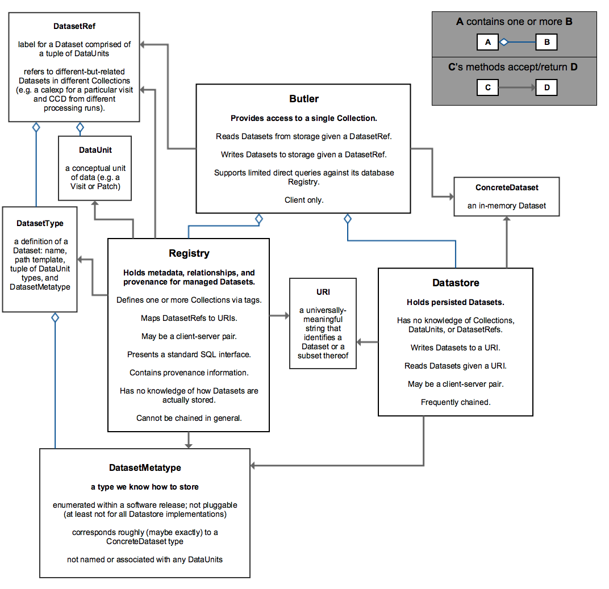

..

:tocdepth: 1

.. note::

   **This technote is not yet published.**

    This document describes a possible design for data access APIs.
    At this time it is purely meant to facilitate discussion in the Butler Working Group.

.. _Overview:

Overview
========

This section describes the different concepts and interfaces in the data access system, and the relations between them.

.. _Dataset:

Dataset
-------

Represents a single entity of data, with associated metadata (e.g. a particular ``calexp`` for a particular instrument corresponding to a particular visit and sensor).

.. _DatasetType:

DatasetType
-----------

The conceptual type of which :ref:`Datasets <Dataset>` are instances (e.g. ``calexp``).

.. _ConcreteDataset:

ConcreteDataset
---------------

The in-memory manifestation of a :ref:`Dataset` (e.g. an ``afw::image::Exposure`` with the contents of a particular ``calexp``).

.. _DatasetMetatype:

DatasetMetatype
---------------

A category of :ref:`DatasetTypes <DatasetType>` that utilize the same in-memory classes for their :ref:`ConcreteDatasets <ConcreteDataset>` and can be saved to the same file format(s).

.. _DataUnit:

DataUnit
--------

Represents a discrete unit of data (e.g. a particular visit, tract, or filter).

In the :ref:`Common Schema <CommonSchema>`, a :ref:`DataUnit` is a row in the table for its :ref:`DataUnitType`.  :ref:`DataUnits <DataUnit>` must be shared across different collections (which may be backed by different database systems), so their primary keys in the :ref:`CommonSchema` must not be database-specific quantities such as autoincrement fields.

.. _DataUnitType:

DataUnitType
------------

The conceptual type of a :ref:`DataUnit` (such as visit, tract, or filter).

In the :ref:`Common Schema <CommonSchema>`, each :ref:`DataUnitType` is a table that the holds :ref:`DataUnits <DataUnit>` of that type as its rows.

.. _Quantum:

Quantum
-------

A unit of work.

.. _DatasetRef:

DatasetRef
----------

A unique identifier for a :ref:`Dataset` across :ref:`Data Collections <Collection>`.  A :ref:`DatasetRef` is conceptually just combination of a :ref:`DatasetType` and a tuple of :ref:`DataUnits <DataUnit>`.

In the :ref:`Common Schema <CommonSchema>`, a :ref:`DatasetRef` is a row in the table for its :ref:`DatasetType`, with a foreign key field pointing to a :ref:`DataUnit` row for each element in tuple of :ref:`DataUnits <DataUnit>`.

.. _Collection:

Collection
----------

An entity that contains :ref:`Datasets <Dataset>` with the following three properties:

- Has at most one :ref:`Dataset` per :ref:`DatasetRef`.
- Has a unique, human-readable identifier (i.e. :ref:`CollectionTag`).
- Provides enough information to obtain a globally (across collections) unique :ref:`Uri` given a :ref:`DatasetRef`.

.. _CollectionTag:

CollectionTag
-------------

Unique identifier of a :ref:`Collection` within a :ref:`Registry`.

.. note::

  That such tags need to be storable in a :ref:`ButlerConfiguration` file.

.. _DatasetExpression:

DatasetExpression
-----------------

An expression (SQL query against the :ref:`Common Schema <CommonSchema>`) that can be evaluated to yield one or more unique :ref:`DatasetRefs <DatasetRef>` and their relations (in a :ref:`DataGraph`).

An open question is if it is sufficient to only allow users to vary the ``WHERE`` clause of the SQL query, or if custom joins are also required.

.. _DataGraph:

DataGraph
---------

A graph in which the nodes are :ref:`DatasetRefs <DatasetRef>` and :ref:`DataUnits <DataUnit>`, and the edges are the relations between them.

.. _QuantumGraph:

QuantumGraph
------------

A directed acyclic graph in which the nodes are :ref:`Datasets <Dataset>` and :ref:`Quantums <Quantum>`, and the edges are the relations between them.  This can be used to describe the to-be-executed processing defined by SuperTask preflight, or the provenance of already-produced :ref:`Datasets <Dataset>`.

.. _Uri:

Uri
---

A standard Uniform Resource Identifier pointing to a :ref:`ConcreteDataset` in a :ref:`Datastore`.

The :ref:`Dataset` pointed to may be **primary** or a :ref:`Component <DatasetComponents>` of a **composite**, but should always be serializable on its own.
When supported by the :ref:`Datastore` the query part of the Uri (i.e. the part behind the optional question mark) may be used for continuous subsets (e.g. a region in an image).

.. _Path:

Path
----

The **path** part of a :ref:`Uri`. Typically provided as a hint to the :ref:`Datastore` to suggest a storage location/naming. The actual :ref:`Uri` used for storage is not required to respect the hint (e.g. for object stores).

.. _DatasetComponents:

DatasetComponents
-----------------

A dictionary of named components in a **composite** :ref:`Dataset`.
The entries in the dictionary are of `str : (Uri, DatasetMetatype)` type.

.. _Registry:

Registry
--------

Holds metadata, relationships, and provenance for managed :ref:`Datasets <Dataset>`.

Typically a SQL database (e.g. `PostgreSQL`, `MySQL` or `SQLite`) that provides a
realization of the :ref:`Common Schema <CommonSchema>`.

.. _Datastore:

Datastore
---------

Holds persisted :ref:`Datasets <Dataset>`.

This may be a (shared) filesystem, an object store
or some other system.

.. _ButlerConfiguration:

ButlerConfiguration
-------------------

Configuration for :ref:`Butler`.

.. _Butler:

Butler
------

Provides access to a single collection.

.. _StorageButler:

StorageButler
-------------

Is a :ref:`Butler` that only provides the IO methods `get` and `put`.
It does not hold a :ref:`Registry` and may or may not
hold a :ref:`Datastore`.

.. _Operations:

Operations
==========

In order to understand how operations are performed it is helpful to examine
the framework structure.

.. _framework_structure:

Users primarily interact with a particular :ref:`Butler` instance that 
**provides access to a single** :ref:`Collection`.

They can use this instance to:

* Load a :ref:`Dataset` associated with a particular :ref:`DatasetRef`,
* Store a :ref:`Dataset` associated with a particular :ref:`DatasetRef`, and
* Obtain a :ref:`DataGraph`, which is a related set of :ref:`DatasetRefs <DatasetRef>`,
  :ref:`DataUnits <DataUnit>` and :ref:`Quanta <Quantum>`, corresponding
  to a (limited) SQL query.

The :ref:`Butler` implements these requests by holding a **single instance** of :ref:`Registry`
and **one or more instances** of :ref:`Datastore`, to which it delegates the calls.

These compenents constitute a separation of concerns:

* :ref:`Registry` has no knowledge of how :ref:`Datasets <Dataset>` are actually stored, and
* :ref:`Datastore` has no knowledge of how :ref:`Datasets <Dataset>` are related and their scientific meaning (i.e. knows nothing about :ref:`Collections <Collection>`, :ref:`DataUnits <DataUnit>` and :ref:`DatasetRefs <DatasetRef>`).

This separation of conserns is a key feature of the design and allows for different
implementations (or backends) to be easily swapped out, potentially even at runtime.

Communication between the components is mitigated by the:

* :ref:`Uri` that records **where** a :ref:`Dataset` is stored, and the
* :ref:`DatasetMetatype` that holds information about **how** a :ref:`Dataset` can be stored.

The :ref:`Registry` is responsible for providing the :ref:`DatasetMetatype` for
to be stored :ref:`Datasets <Dataset>` and the :ref:`Datastore` is responsible
for providing the :ref:`Uri` from where it can be subsequently retrieved.

.. note::

    Both the :ref:`Registry` and the :ref:`Datastore` typically each
    come as a client/server pair.  In some cases the server part may be a direct backend,
    such as a SQL server or a filesystem, that does not require any extra software daemon.
    But for some cases, such as when server-side subsetting of a :ref:`Dataset` is needed, a
    daemon will be required.

.. _basic_io:

Basic IO
--------

To see how the various components interact we first examine a basic ``get`` and ``put`` operations for the basic case of a non-composite :ref:`Dataset`.
We assume that the :ref:`Butler` is configured with an external :ref:`Registry` and :ref:`Datastore`, both consisting of a client-server pair.

Basic ``get``
^^^^^^^^^^^^^

The user has a :ref:`DatasetRef`, constructed or obtained by a query and wishes to retrieve the associated :ref:`ConcreteDataset`.

This proceeds allong the following steps:

1. User calls: ``butler.get(datasetRef)``.
2. :ref:`Butler` forwards this call to its :ref:`Registry`, adding the :ref:`CollectionTag` it was configured with (i.e. ``butler.registry.find(butler.config.collectionTag, datasetRef)``).
3. :ref:`Registry` performs the lookup on the server using SQL and returns the :ref:`Uri` and the :ref:`DatasetMetatype` of the stored :ref:`Dataset`.
4. :ref:`Butler` forwards the request, with both the :ref:`Uri` and the :ref:`DatasetMetatype`, to the :ref:`Datastore` client (i.e. ``butler.datastore.get(uri, datasetMetatype)``).
5. :ref:`Datastore` client requests a serialized version of the :ref:`Dataset` from the server using the :ref:`Uri`.
6. Using the :ref:`DatasetMetatype`, to determine the appropriate deserialization function, the :ref:`Datastore` client then materializes the :ref:`ConcreteDataset` and returns it to the :ref:`Butler`.
7. :ref:`Butler` then returns the :ref:`ConcreteDataset` to the user.

See :py:meth:`the API documentation <Butler.get>` for more information.

.. note::

    The :ref:`Datastore` request can be a simple ``HTTP GET`` request for a stored FITS file, or something more complicated.
    In the former case the materialization would be a simple FITS read (e.g. of a ``calexp``), with the reader determined by the :ref:`DatasetMetatype` retrieved from the :ref:`Registry`.

.. note::

    The serialized version sent over the wire doesn't have to correspond to the format stored on disk in the :ref:`Datastore` server.  As long as it is serialized in the form expected by the client.

Basic ``put``
^^^^^^^^^^^^^

The user has a :ref:`ConcreteDataset` and wishes to store this at a particular :ref:`DatasetRef`.

This proceeds allong the following steps:

1. User calls: ``butler.put(datasetRef, concreteDataset)``.
2. :ref:`Butler` first obtains the correct :ref:`DatasetMetatype` from the :ref:`Registry` by calling ``butler.registry.getDatasetMetatype(butler.config.collectionTag, datasetRef)``.
3. :ref:`Butler` obtains a :ref:`Path` from the :ref:`Registry` by calling ``butler.registry.makePath(butler.config.collectionTag, datasetRef)``. This path is a hint to be used by the :ref:`Datastore` to decide where to store it.
4. :ref:`Butler` then asks the :ref:`Datastore` client to store the file by calling: ``butler.datastore.put(concreteDataset, datasetMetatype, path)``.
5. The :ref:`Datastore` client then uses the serialization function associated with the :ref:`DatasetMetatype` to serialize the :ref:`ConcreteDataset` and sends it to the :ref:`Datastore` server.
   Depending on the type of server it may get back the actual :ref:`Uri` or the client can generate it itself.
6. :ref:`Datastore` returns the actual :ref:`Uri` to the :ref:`Butler`.
7. :ref:`Butler` calls the :ref:`Registry` function ``addDataset`` to add the :ref:`Dataset` to the collection.
8. :ref:`Butler` returns the :ref:`Uri` to the user.

See :py:class:`the API documentation <Butler.put>` for more information.

.. _composites:

Composites
----------

A :ref:`Dataset` can be **composite**, in which case it consists of a **parent** :ref:`Dataset` and one or more child :ref:`Datasets <Dataset>`.  An example would be an ``Exposure`` which consists of a ``Wcs`` a ``Mask`` and an ``Image``.  There are several ways this may be stored by the :ref:`Datastore`:

* As part of the parent :ref:`Dataset` (e.g. the full ``Exposure`` is written to a single FITS file).
* As a set of entities without a parent (e.g. only the ``Wcs``, ``Mask`` and ``Image`` are written separately and the ``Exposure`` needs to be composed from them).
* As a mix of the two extremes (e.g. the ``Mask`` and ``Image`` are part of the ``Exposure`` file but the ``Wcs`` is written to a separate file).

In either case the user expects to be able to read an individual component, and in case the components are stored separately the transfer should be efficient.

In addition, it is desirable to **override** parts of a composite :ref:`Dataset` (e.g. updated metadata).

To support this the :ref:`Registry` is also responsible for storing the component :ref:`Datasets <Dataset>` of the **composite**.

The ``registry.find()`` call therefore not only returns the :ref:`Uri` and :ref:`DatasetMetatype` of the **parent** (associated with the :ref:`DatasetRef`), but also a :ref:`DatasetComponents` dictionary of ``name : (Uri, DatasetMetatype)`` specifying its **children**.

The :ref:`Butler` retrieves **all** :ref:`Datasets <Dataset>` from the :ref:`Datastore` as :ref:`ConcreteDatasets <ConcreteDataset>` and then calls the ``assemble`` function associated with the :ref:`DatasetMetatype` of the primary to create the final composed :ref:`ConcreteDataset`.

This process is most easily understood by reading the API documentation for :py:meth:`butler.get <Butler.get>` and :py:meth:`butler.put <Butler.put>`.

.. note::

    Only one level of composition is supported.

.. _API:

Python API
==========

This section describes the Python API.

.. note::

    Not all concepts map to an actual class.

.. py:class:: DatasetMetatype

    An abstract base class whose subclasses are :ref:`DatasetMetatypes <DatasetMetatype>`.

    .. py:attribute:: registry

        Concrete class attribute: provided by the base class.

        A dictionary holding all :py:class:`DatasetMetatype` subclasses,
        keyed by their :py:attr:`name` attributes.

    .. py:attribute:: name

        Virtual class attribute: must be provided by derived classes.

        A string name that uniquely identifies the derived class.

    .. py:attribute:: components

        Virtual class attribute: must be provided by derived classes.

        A dictionary that maps component names to the :py:class:`DatasetMetatype` subclasses for those components.
        Should be empty (or ``None``?) if the :ref:`DatasetMetatype` is not a composite.

    .. py:method:: assemble(parent, components, parameters=None)

        Assemble a compound :ref:`ConcreteDataset`.

        Virtual method: must be implemented by derived classes.

        :param ConcreteDataset parent:
            An instance of the compound :ref:`ConcreteDataset` to be returned, or None.
            If no components are provided, this is the :ref:`ConcreteDataset` that will be returned.

        :param dict components: A dictionary whose keys are a subset of the keys in the :py:attr:`components` class attribute and whose values are instances of the component ConcreteDataset type.

        :param dict parameters: details TBD; may be used for parameterized subsets of :ref:`Datasets <Dataset>`.

        :return: a :ref:`ConcreteDataset` matching `parent` with components replaced by those in `components`.

.. py:class:: Registry

    .. py:method:: addDatasetType(CollectionTag, DatasetType, template) -> None

        Add a new :ref:`DatasetType`.

          .. todo::

<<<<<<< HEAD
``get(Uri, parameters=None) -> ConcreteDataset``
  Load a :ref:`ConcreteDataset` from the store.  Optional ``parameters`` may specify
  things like regions.
``put(ConcreteDataset, DatasetMetatype, Path) -> Uri, DatasetComponents``
  Write a :ref:`ConcreteDataset` with a given :ref:`DatasetMetatype` to the store.
  The :ref:`DatasetMetatype` is used to determine the serialization format.
  The ``Path`` is a storage hint.  The actual ``Uri`` of the stored :ref:`Dataset` is returned as are the possible :ref:`DatasetComponents`.
=======
            Define DatasetType as a class; may remove the need for the template arguments.
>>>>>>> Convert more of the API section to improved markup.

    .. py:method:: addDataset(CollectionTag, DatasetRef, Uri, DatasetComponents, Quantum=None) -> None

        Add a :ref:`Dataset`. Optionally indicates which :ref:`Quantum` generated it.

    .. py:method:: addQuantum(CollectionTag, Quantum) -> None

        Add a new :ref:`Quantum`.

    .. py:method:: addDataUnit(CollectionTag, DataUnit, replace=False) -> None

        Add a new :ref:`DataUnit`, optionally replacing an existing one (for updates).

    .. py:method:: find(CollectionTag, DatasetRef) -> Uri, DatasetMetatype, DatasetComponents

        Lookup the location of the :ref:`Dataset` associated with the given `DatasetRef` in a :ref:`Datastore`.
        Also return its :ref:`DatasetMetatype` and (optional) :ref:`DatasetComponents`.

    .. py:method:: makeDataGraph(CollectionTag, DatasetExpression, [DatasetType, ...]) -> DataGraph

        Evaluate a :ref:`DatasetExpression` given a list of :ref:`DatsetTypes <DatasetType>` and return a :ref:`DataGraph`.

        .. todo::
            Should we also supply a ``findAll`` or something to give you just a list
            of :ref:`Datasets <Dataset>`?  Or should the :ref:`DataGraph` be iterable
            (I guess it already is) such that one can loop over the results of a query
            and retrieve all relevant :ref:`Datasets <Dataset>`?

    .. py:method:: makePath(CollectionTag, DatasetRef) -> Path

        Construct the `Path` part of a :ref:`Uri`. This is often just a storage hint since the
        :ref:`Datastore` will likely have to deviate from the provided path
        (in the case of an object-store for instance).

    .. py:method:: subset(CollectionTag, DatasetExpression, [DatasetType, ...]) -> CollectionTag

        Create a new :ref:`Collection` by subsetting an existing one.

    .. py:method:: merge([CollectionTag, ...]) -> CollectionTag

        Create a new :ref:`Collection` from a series of existing ones.

        The ordering matters, such that identical :ref:`DatasetRefs <DatasetRef>` override,
        with those earlier in the list remaining.

    .. py:method:: export(CollectionTag) -> str

        Export contents of :ref:`Registry` for a given :ref:`CollectionTag` in a text
        format that can be imported into a different database.

        .. todo::
            This may not be the most efficient way of doing things.  But we should provide some generic
            way of transporting collections between databases.

    .. py:method:: import(str)

        Import (previously exported) contents into the (possibly empty) :ref:`Registry`.

.. py:class:: Datastore

    .. py:method:: get(uri, parameters=None) -> ConcreteDataset

        Load a :ref:`ConcreteDataset` from the store.  Optional ``parameters`` may specify things like regions.

    .. py:method:: put(ConcreteDataset, DatasetMetatype, Path) -> Uri

        Write a :ref:`ConcreteDataset` with a given :ref:`DatasetMetatype` to the store.
        The :ref:`DatasetMetatype` is used to determine the serialization format.
        The ``Path`` is a storage hint.  The actual ``Uri`` of the stored :ref:`Dataset` is returned.

        .. note::
            This is needed because some :ref:`datastores <Datastore>` may need to modify the :ref:`Uri`.
            Such is the case for object stores (which can return a hash) for instance.

    .. py:method:: retrieve({Uri (from) : Uri (to)}) -> None

        Retrieves :ref:`Datasets <Dataset>` and stores them in the provided locations.
        Does not have to go through the process of creating a :ref:`ConcreteDataset`.

        .. todo::
            How does this handle composites?

.. py:class:: ButlerConfiguration

    .. py:attribute:: inputCollections

        An ordered list of :ref:`CollectionTags <CollectionTag>` to use for input (first :ref:`Dataset` found is used).

    .. py:attribute:: outputCollections

        A list of :ref:`CollectionTags <CollectionTag>` to use for output (the same output goes to all :ref:`collections <Collection>`).

.. py:class:: Butler

    .. py:attribute:: config

        a :py:class:`ButlerConfiguration` instance

    .. py:attribute:: datastore

        a :py:class:`Datastore` instance

    .. py:attribute:: registry

        a :py:class:`Registry` instance

    .. py:method:: get(DatasetRef, parameters=None) -> ConcreteDataset

        Implemented as:

        .. code:: python

            for collectionTag in config.inputCollections:
                try:
                    uri, datasetMetatype, datasetComponents = RDB.find(collectionTag, datasetRef)
                    parent = RDS.get(uri, datsetMetatype, parameters) if uri else None
                    children = {name : RDS.get(childUri, childMeta, parameters) for name, (childUri, childMeta) in datasetComponents.items()}
                    return datasetMetatype.assemble(parent, children, parameters)
                except NotFoundError:
                    continue
                raise NotFoundError("DatasetRef {} not found in any input collection".format(datasetRef))

    .. py:method:: put(DatasetRef, ConcreteDataset, Quantum) -> None
        Implemented as:

        .. code:: python

            for collectionTag in config.outputCollections:
                datasetMetatype = RDB.getDatasetMetatype(collectionTag, datasetRef)
                path = RDB.makePath(collectionTag, datasetRef)
                uri = RDS.put(concreteDataset, datasetMetatype, path)
                RDB.addDataset(collectionTag, datasetRef, uri, datasetComponents, quantum)

        .. todo::

            Given the similarity in output, we could just use ``find`` to obtain the :ref:`Uri` and
            :ref:`DatasetMetatype` for things that don't yet exist.
            Then we don't need ``makePath`` (and possibly ``getDatasetMetatype``) anymore, which
            would be cleaner IMHO (I don't like ``makePath`` much, it feels like too much internal exposure).

.. _CommonSchema:

Common Schema
=============

The Common Schema is a set of conceptual SQL tables (which may be implemented
as views) that can be used to retrieve :ref:`DataUnit` and :ref:`Dataset`
metadata in any :ref:`Collection`.  Implementations may choose to add
fields to any of the tables described below, but they must have at least the
fields shown here.  The SQL dialect used to construct queries against the
Common Schema is TBD; because different implementations may use different
database systems, we can in general only support a limited common dialect.

The relationship between databases and :ref:`Collections
<Collection>` may be one-to-many or one-to-one in different
implementations, but the Common Schema only provides a view to a single
:ref:`Collection` (except for the tables in the :ref:`Provenance
<cs_provenance>` section).  As a result, for most implementations that take
the one- to-many approach, at least some of the conceptual tables below must
be implemented as views that select only the entries that correspond to a
particular :ref:`Collection`.  We will refer to them as "tables" in the
rest of this system only for brevity.

The common schema is only intended to be used for SELECT queries.  Operations
that add or remove :ref:`DataUnits <DataUnit>` or :ref:`Datasets <Dataset>` (or
types thereof) to/from a :ref:`Collection` will be supported through 
Python APIs, but the SQL behind these APIs will in general be specific to the
actual (private) schema used to implement the data collection and possibly the
database system and its associated SQL dialect.

.. _cs_camera_dataunits:

Camera DataUnits
----------------

+------------+--------+-------------+
| *Camera*                          |
+============+========+=============+
| camera_id  | uint64 | PRIMARY KEY |
+------------+--------+-------------+
| name       | str    | UNIQUE      |
+------------+--------+-------------+

Entries in the Camera table are essentially just sources of raw data with a
constant layout of PhysicalSensors and a self-constent numbering system for
Visits.  Different versions of the same camera (due to e.g. changes in
hardware) should still correspond to a single row in this table.

+----------------------+--------+----------------------+
| *AbstractFilter*                                     |
+======================+========+======================+
| abstract_filter_id   | uint64 | PRIMARY KEY          |
+----------------------+--------+----------------------+
| name                 | str    | NOT NULL UNIQUE      |
+----------------------+--------+----------------------+

+----------------------+--------+--------------------------------------------------+
| *PhysicalFilter*                                                                 |
+======================+========+==================================================+
| physical_filter_id   | uint64 | PRIMARY KEY                                      |
+----------------------+--------+--------------------------------------------------+
| name                 | str    | NOT NULL                                         |
+----------------------+--------+--------------------------------------------------+
| camera_id            | uint64 | NOT NULL REFERENCES Camera (camera_id)           |
+----------------------+--------+--------------------------------------------------+
| abstract_filter_id   | uint64 | REFERENCES AbstractFilter (abstract_filter_id)   |
+----------------------+--------+--------------------------------------------------+
| UNIQUE (name, camera_id)                                                         |
+----------------------------------------------------------------------------------+

Entries in the PhysicalFilter table represent the bandpass filters that can be
associated with a particular visit.  These are different from AbstractFilters,
which are used to label Datasets that aggregate data from multiple Visits.
Having these two different DataUnits for filters is necessary to make it
possible to combine data from Visits taken with different filters.  A
PhysicalFilter may or may not be associated with a particular AbstractFilter.
AbstractFilter is the only DataUnit not associated with either a Camera or a
SkyMap.

+----------------------+--------+-----------------------------------------+
| *PhysicalSensor*                                                        |
+======================+========+=========================================+
| physical_sensor_id   | uint64 | PRIMARY KEY                             |
+----------------------+--------+-----------------------------------------+
| number               | uint16 |                                         |
+----------------------+--------+-----------------------------------------+
| name                 | str    | NOT NULL                                |
+----------------------+--------+-----------------------------------------+
| camera_id            | uint64 | NOT NULL REFERENCES Camera (camera_id)  |
+----------------------+--------+-----------------------------------------+
| group                | str    |                                         |
+----------------------+--------+-----------------------------------------+
| purpose              | str    | NOT NULL                                |
+----------------------+--------+-----------------------------------------+
| UNIQUE (number, camera_id)                                              |
+-------------------------------------------------------------------------+
| UNIQUE (name, camera_id)                                                |
+-------------------------------------------------------------------------+

PhysicalSensors actually represent the "slot" for a sensor in a camera,
independent of both any observations and the actual detector (which may change
over the life of the camera).  The ``group`` field may mean different things
for different cameras (such as rafts for LSST, or groups of sensors oriented
the same way relative to the focal plane for HSC).  The ``purpose`` field
indicates the role of the sensor (such as science, wavefront, or guiding).
Because some cameras identify sensors with string names and other use numbers,
we provide fields for both; the name may be a stringified integer, and the
number may be autoincrement.

+----------------------+----------+-----------------------------------------------------------+
| *Visit*                                                                                     |
+======================+==========+===========================================================+
| visit_id             | uint64   | PRIMARY KEY                                               |
+----------------------+----------+-----------------------------------------------------------+
| number               | uint64   | NOTNULL                                                   |
+----------------------+----------+-----------------------------------------------------------+
| camera_id            | uint64   | NOT NULL REFERENCES Camera (camera_id)                    |
+----------------------+----------+-----------------------------------------------------------+
| physical_filter_id   | uint64   | NOT NULL REFERENCES AbstractFilter (abstract_filter_id)   |
+----------------------+----------+-----------------------------------------------------------+
| obs_begin            | datetime | NOT NULL                                                  |
+----------------------+----------+-----------------------------------------------------------+
| obs_end              | datetime | NOT NULL                                                  |
+----------------------+----------+-----------------------------------------------------------+
| region               | blob     |                                                           |
+----------------------+----------+-----------------------------------------------------------+
| UNIQUE (number, camera_id)                                                                  |
+---------------------------------------------------------------------------------------------+

Entries in the Visit table correspond to observations with the full camera at
a particular pointing, possibly comprised of multiple exposures (Snaps).  A
Visit's ``region`` field holds an approximate but inclusive representation of
its position on the sky that can be compared to the ``regions`` of other
DataUnits.

+----------------------+--------+-----------------------------------------------------------+
| *ObservedSensor*                                                                          |
+======================+========+===========================================================+
| observed_sensor_id   | uint64 | PRIMARY KEY                                               |
+----------------------+--------+-----------------------------------------------------------+
| physical_sensor_id   | uint64 | NOT NULL REFERENCES PhysicalSensor (physical_sensor_id)   |
+----------------------+--------+-----------------------------------------------------------+
| visit_id             | uint64 | NOT NULL REFERENCES Visit (visit_id)                      |
+----------------------+--------+-----------------------------------------------------------+
| region               | blob   |                                                           |
+----------------------+--------+-----------------------------------------------------------+
| UNIQUE (physical_sensor_id, visit_id)                                                     |
+-------------------------------------------------------------------------------------------+

An ObservedSensor is simply a combination of a Visit and a PhysicalSensor, but
unlike most other DataUnit combinations (which are not typically DataUnits
themselves), this one is both ubuiquitous and contains additional information:
a ``region`` that represents the position of the observed sensor image on the
sky.

+----------------------------+----------+---------------------------------------+
| *Snap*                                                                        |
+============================+==========+=======================================+
| snap_id                    | uint64   | PRIMARY KEY                           |
+----------------------------+----------+---------------------------------------+
| number                     | uint16   | NOT NULL                              |
+----------------------------+----------+---------------------------------------+
| visit_id                   | uint64   | NOT NULL REFERENCES Visit (visit_id)  |
+----------------------------+----------+---------------------------------------+
| obs_begin                  | datetime | NOT NULL                              |
+----------------------------+----------+---------------------------------------+
| obs_end                    | datetime | NOT NULL                              |
+----------------------------+----------+---------------------------------------+
| UNIQUE (number, visit_id)                                                     |
+----------------------------+----------+---------------------------------------+

A Snap is a single-exposure subset of a Visit.  Most non-LSST Visits will have
only a single Snap.

.. _cs_skymap_dataunits:

SkyMap DataUnits
----------------

+------------+--------+-------------+
| *SkyMap*                          |
+============+========+=============+
| skymap_id  | uint64 | PRIMARY KEY |
+------------+--------+-------------+
| name       | str    | UNIQUE      |
+------------+--------+-------------+

Each SkyMap entry represents a different way to subdivide the sky into tracts
and patches, including any parameters involved in those defitions (i.e.
different configurations of the same ``lsst.skymap.BaseSkyMap`` subclass yield
different rows).  While SkyMaps need unique, human-readable names, it may also
be wise to add a hash or pickle of the SkyMap instance that defines the
mapping to avoid duplicate entries (not yet included).

+-----------------------------+--------+-----------------------------------------+
| *Tract*                                                                        |
+=============================+========+=========================================+
| tract_id                    | uint64 | PRIMARY KEY                             |
+-----------------------------+--------+-----------------------------------------+
| number                      | uint16 | NOT NULL                                |
+-----------------------------+--------+-----------------------------------------+
| skymap_id                   | uint64 | NOT NULL REFERENCES SkyMap (skymap_id)  |
+-----------------------------+--------+-----------------------------------------+
| region                      | blob   |                                         |
+-----------------------------+--------+-----------------------------------------+
| UNIQUE (number, skymap_id)                                                     |
+-----------------------------+--------+-----------------------------------------+

A Tract is a contiguous, simple area on the sky with a 2-d Euclidian
coordinate system defined by a single map projection.  If the parameters of
the sky projection and the Tract's various bounding boxes can be standardized
across all SkyMap implementations, it may be useful to include them in the
table as well.

+---------------------------+--------+----------------------------------------+
| *Patch*                                                                     |
+===========================+========+========================================+
| patch_id                  | uint64 | PRIMARY KEY                            |
+---------------------------+--------+----------------------------------------+
| index                     | uint16 | NOT NULL                               |
+---------------------------+--------+----------------------------------------+
| tract_id                  | uint64 | NOT NULL REFERENCES SkyMap (tract_id)  |
+---------------------------+--------+----------------------------------------+
| region                    | blob   |                                        |
+---------------------------+--------+----------------------------------------+
| UNIQUE (index, tract_id)                                                    |
+---------------------------+--------+----------------------------------------+

Tracts are subdivided into Patches, which share the Tract coordinate system
and define similarly-sized regions that overlap by a configurable amount.  As
with Tracts, we may want to include fields to describe Patch boundaries in this
table in the future.

.. _cs_calibration_dataunits:

Calibration DataUnits
---------------------

+---------------------------+--------+-------------------------------------------------+
| *CalibRange*                                                                         |
+===========================+========+=================================================+
| calib_range_id            | uint64 | PRIMARY KEY                                     |
+---------------------------+--------+-------------------------------------------------+
| first_visit               | uint64 | NOT NULL                                        |
+---------------------------+--------+-------------------------------------------------+
| last_visit                | uint64 |                                                 |
+---------------------------+--------+-------------------------------------------------+
| camera_id                 | uint64 | NOT NULL REFERENCES Camera (camera_id)          |
+---------------------------+--------+-------------------------------------------------+
| physical_filter_id        | uint64 | REFERENCES PhysicalFilter (physical_filter_id)  |
+---------------------------+--------+-------------------------------------------------+
| UNIQUE (first_visit, last_visit, camera_id, physical_filter_id)                      |
+---------------------------+--------+-------------------------------------------------+

+------------------------+--------+-----------------------------------------------------------+
| *SensorCalibRange*                                                                          |
+========================+========+===========================================================+
| sensor_calib_range_id  | uint64 | PRIMARY KEY                                               |
+------------------------+--------+-----------------------------------------------------------+
| first_visit            | uint64 | NOT NULL                                                  |
+------------------------+--------+-----------------------------------------------------------+
| last_visit             | uint64 |                                                           |
+------------------------+--------+-----------------------------------------------------------+
| physical_sensor_id     | uint64 | NOT NULL REFERENCES PhysicalSensor (physical_sensor_id)   |
+------------------------+--------+-----------------------------------------------------------+
| physical_filter_id     | uint64 | REFERENCES PhysicalFilter (physical_filter_id)            |
+------------------------+--------+-----------------------------------------------------------+
| UNIQUE (first_visit, last_visit, camera_id, physical_sensor_id, physical_filter_id)         |
+------------------------+--------+-----------------------------------------------------------+

Master calibration products are defined over a range of Visits from a given
Camera, though a range of observation dates could be utilized instead.
Calibration products may additionally be specialized for a particular
PhysicalFilter, or may be appropriate for all PhysicalFilters by setting the
``physical_filter_id`` field to ``NULL``.  Calibration products that are
defined for individual sensors should use ``SensorCalibRange``.

.. _cs_dataunit_joins:

DataUnit Joins
--------------

The tables in this section represent many-to-many joins between DataUnits
defined in the previous section that can be generated programmatically.  These
join tables have no primary key (at least not as part of the common schema),
and hence cannot be used to label Datasets.

+------------------+--------+---------------------------------------------------+
| *CalibRangeJoin*                                                              |
+==================+========+===================================================+
| calib_range_id   | uint64 | NOT NULL REFERENCES CalibRange (calib_range_id)   |
+------------------+--------+---------------------------------------------------+
| visit_id         | uint64 | NOT NULL REFERENCES Visit (visit_id)              |
+------------------+--------+---------------------------------------------------+

+--------------------------+--------+-----------------------------------------------------------------+
| *SensorCalibRangeJoin*                                                                              |
+==========================+========+=================================================================+
| sensor_calib_range_id    | uint64 | NOT NULL REFERENCES SensorCalibRange (sensor_calib_range_id)    |
+--------------------------+--------+-----------------------------------------------------------------+
| observed_sensor_id       | uint64 | NOT NULL REFERENCES ObservedSensor (observed_sensor_id)         |
+--------------------------+--------+-----------------------------------------------------------------+

The above two tables define the joins between master calibration Datasets and
the observations they should be used to calibrate.  These can be defined
directly as views in on the DataUnit tables:

.. code-block:: sql

    CREATE VIEW CalibRangeJoin AS
        SELECT
            Visit.visit_id,
            CalibRange.calib_range_id
        FROM
            Visit INNER JOIN CalibRange ON (
                (Visit.num BETWEEN CalibRange.first_visit AND CalibRange.last_visit)
                AND Visit.physical_filter_id = CalibRange.physical_filter_id
            );

    CREATE VIEW SensorCalibRangeJoin
        SELECT
            ObservedSensor.observed_sensor_id,
            SensorCalibRange.sensor_calib_range_id
        FROM
            ObservedSensor INNER JOIN Visit ON (ObservedSensor.visit_id = Visit.visit_id)
            INNER JOIN SensorCalibRange ON (
                (Visit.num BETWEEN SensorCalibRange.first_visit AND SensorCalibRange.last_visit)
                AND Visit.physical_filter_id = SensorCalibRange.physical_filter_id
            );

The remaining join tables represent the spatial relationships between
observations and SkyMap entities; records should only be present in these
tables when the two entities overlap as defined by their ``region`` fields.

+----------------------+--------+-----------------------------------------------------------+
| *SensorPatchJoin*                                                                         |
+======================+========+===========================================================+
| observed_sensor_id   | uint64 | NOT NULL REFERENCES ObservedSensor (observed_sensor_id)   |
+----------------------+--------+-----------------------------------------------------------+
| patch_id             | uint64 | NOT NULL REFERENCES Patch (patch_id)                      |
+----------------------+--------+-----------------------------------------------------------+

+----------------------+--------+-----------------------------------------------------------+
| *SensorTractJoin*                                                                         |
+======================+========+===========================================================+
| observed_sensor_id   | uint64 | NOT NULL REFERENCES ObservedSensor (observed_sensor_id)   |
+----------------------+--------+-----------------------------------------------------------+
| tract_id             | uint64 | NOT NULL REFERENCES Tract (tract_id)                      |
+----------------------+--------+-----------------------------------------------------------+

+------------+--------+----------------------------------------+
| *VisitPatchJoin*                                             |
+============+========+========================================+
| visit_id   | uint64 | NOT NULL REFERENCES Visit (visit_id)   |
+------------+--------+----------------------------------------+
| patch_id   | uint64 | NOT NULL REFERENCES Patch (patch_id)   |
+------------+--------+----------------------------------------+

+------------+--------+----------------------------------------+
| *VisitTractJoin*                                             |
+============+========+========================================+
| visit_id   | uint64 | NOT NULL REFERENCES Visit (visit_id)   |
+------------+--------+----------------------------------------+
| tract_id   | uint64 | NOT NULL REFERENCES Tract (tract_id)   |
+------------+--------+----------------------------------------+

.. _cs_datasets:

Datasets
--------

Because the :ref:`DatasetTypes <DatasetType>` present in a
:ref:`Collection` may vary from collection to collection, the
:ref:`Dataset` tables in the Common Schema are defined dynamically according to
a set of rules:

 - There is a table for each :ref:`DatasetType`, with entries corresponding to
   :ref:`Datasets <Dataset>` that are present in the :ref:`Collection` (and
   only these).

 - The name of the table should be the name of the :ref:`DatasetType`.

 - The table has a foreign key field relating to each :ref:`DataUnit` table that
   is used to label the :ref:`DatasetType`.

 - The table has at least the following additional fields:

+------------+--------+---------------------------------------------+
| dataset_id | uint64 | PRIMARY KEY REFERENCES Dataset (dataset_id) |
+------------+--------+---------------------------------------------+
| uri        | str    |                                             |
+------------+--------+---------------------------------------------+

The ``dataset_id`` field is both a primary key that must be unique across
elements in this table and a link to the more general Dataset table described in
the :ref:`Provenance <cs_Provenance>` section; this means that it must be
globally unique across *all* dataset tables, virtually guaranteeing that these
per-:ref:`DatasetType` tables will be implemented as views into a larger table.

The ``uri`` field contains a string that can be used to local the file or other
entity that contains the stored :ref:`Dataset`.  While this may be generated
differently according to different configurations when the file is first
written, after it is written we do not expect the name to change and hence
record it in the database; this reduces the need for implementations to
be aware of past configurations in addition to their current confirguration. For
multi-file composite datasets, this field should be NULL, and another table
(TBD) can be used to associate the composite with its leaf-node :ref:`Datasets
<Dataset>`.

.. _cs_provenance:

Provenance
----------

Provenance queries frequently involve crossing :ref:`Collection` boundaries;
the inputs to a task that produced a particular :ref:`Dataset` may not be
present in the same collection that contains that :ref:`Dataset`.  As a result,
the tables in this section are not restricted to the contents of a single
:ref:`Collection`.

+-----------------+--------+----------------------------------------+
| *DatasetType*                                                     |
+=================+========+========================================+
| dataset_type_id | uint64 | PRIMARY KEY                            |
+-----------------+--------+----------------------------------------+
| name            | str    | NOT NULL UNIQUE                        |
+-----------------+--------+----------------------------------------+

+-------------+--------+---------------------------------+
| *Dataset*                                              |
+=============+========+=================================+
| dataset_id  | uint64 | PRIMARY KEY                     |
+-------------+--------+---------------------------------+
| uri         | str    |                                 |
+-------------+--------+---------------------------------+
| producer_id | uint64 | REFERENCES Quantum (quantum_id) |
+-------------+--------+---------------------------------+

These tables provide another view of the information in the
per-:ref:`DatasetType` tables described in the :ref:`Datasets <cs_datasets>`
section, with the following differences:

 - They provide no way to join with :ref:`DataUnit` tables (aside from joining
   with the per-:ref:`DatasetType` tables themselves on the ``dataset_id``
   field).

 - The Dataset table must contain entries for at least all :ref:`Datasets
   <Dataset>` in the :ref:`Collection`, but it may contain entries for
   additional :ref:`Datasets <Dataset>` as well.

 - These add the ``producer_id`` field, which records the Quantum that produced
   the dataset (if applicable).

+-------------+--------+---------------------------------+
| *Quantum*                                              |
+=============+========+=================================+
| quantum_id  | uint64 | PRIMARY KEY                     |
+-------------+--------+---------------------------------+
| config_id   | uint64 | REFERENCES Dataset (dataset_id) |
+-------------+--------+---------------------------------+
| env_id      | uint64 | REFERENCES Dataset (dataset_id) |
+-------------+--------+---------------------------------+
| task_name   | str    |                                 |
+-------------+--------+---------------------------------+

+-------------+--------+---------------------------------------------+
| *DatasetConsumer*                                                  |
+=============+========+=============================================+
| quantum_id  | uint64 | NOT NULL REFERENCES Quantum (quantum_id)    |
+-------------+--------+---------------------------------------------+
| dataset_id  | uint64 | NOT NULL REFERENCES Dataset (dataset_id)    |
+-------------+--------+---------------------------------------------+

A Quantum (a term borrowed from the SuperTask design) is a discrete unit of
work, such as a single invocation of ``SuperTask.runQuantum``.  It may also be
used here to describe other actions that produce and/or consume :ref:`Datasets
<Dataset>`.  The ``config_id`` and ``env_id`` provide links to :ref:`Datasets
<Dataset>` that hold the configuration and a description of the software and
compute environments.

Because each :ref:`Dataset` can have multiple consumers but at most one
producer, the Quantum that produces a Dataset is recorded in the
Dataset table itself, while the separate join table DatasetConsumers is
used to record the Quantum entries that utilized a Dataset entry.

There is no guarantee that the full provenance of a :ref:`Dataset` is captured
by these tables in a particular :ref:`Collection`, unless the :ref:`Dataset`
and all of its dependencies (any datasets consumed by its producer Quantum,
recursively) are also in the :ref:`Collection`.  When this is not the case,
the provenance information *may* be present (with dependencies included in the
Dataset table), or the ``Dataset.producer_id`` field may be null.  The Dataset
table may also contain entries that are not related at all to those in the
:ref:`Collection`; we have no obvious use for such a restriction, and it is
potentially burdensome on implementations.

.. note::

   As with everything else in the Common Schema, the provenance system used in
   the operations data backbone will almost certainly involve additional fields
   and tables, and what's in the Common Schema will just be a view.  But
   provenance tables here are even more of a blind straw-man than the rest of
   the Common Schema (which is derived more directly from SuperTask
   requirements), and I certainly expect it to change based on feedback; I
   think this reflects all that we need outside the operations system, but how
   operations implements their system should probably influence the details
   (such as how we represent configuration and software environment information).

.. .. rubric:: References

.. Make in-text citations with: :cite:`bibkey`.

.. .. bibliography:: local.bib lsstbib/books.bib lsstbib/lsst.bib lsstbib/lsst-dm.bib lsstbib/refs.bib lsstbib/refs_ads.bib
..    :encoding: latex+latin
..    :style: lsst_aa
